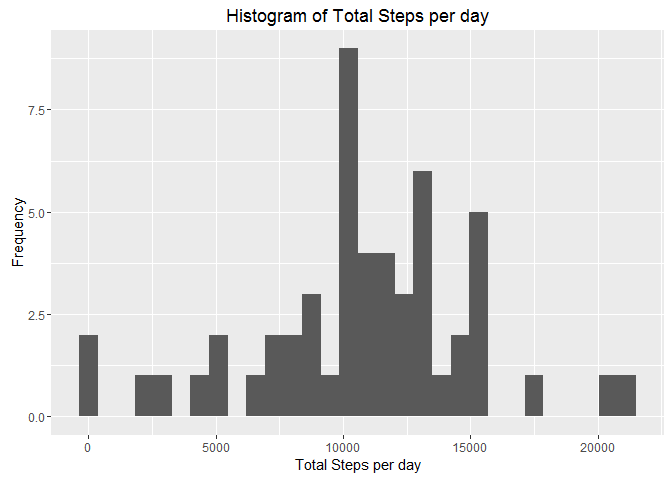
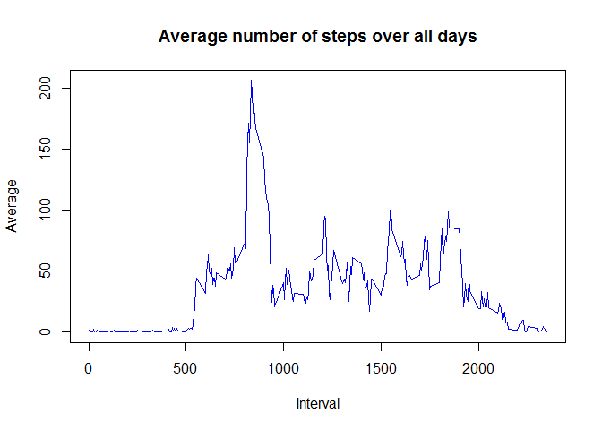
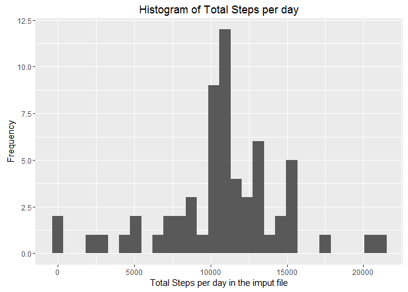
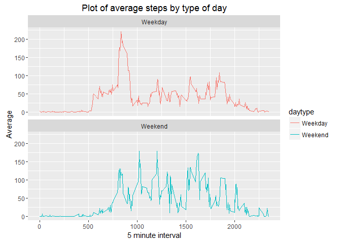

Reproducible Research - Assignment1
========================================
Autor: Andreina torres

#Preprocess
##1-Global enviroment options


```r
library(knitr)
opts_chunk$set(echo = TRUE)
```


##2-Downloading and reading data

The data file was Downloaded from here: [Download file](https://d396qusza40orc.cloudfront.net/repdata%2Fdata%2Factivity.zip)

The variables included in this dataset are:

-steps: Number of steps taking in a 5-minute interval (missing values are coded as NA)  
-date: The date on which the measurement was taken in YYYY-MM-DD format  
-interval: Identifier for the 5-minute interval in which measurement was taken  

The dataset is stored in a comma-separated-value (CSV) file and there are a total of 17,568 observations in this dataset.


```r
setwd("C:/Users/AndreinaDeJ/Documents/Andreina Torres/coursera/cursos y cursera/Coursera/data scientits specialization/5-Reproducible research/week2/asigment")

#Read data form Website to R
temp <- tempfile()
download.file("https://d396qusza40orc.cloudfront.net/repdata%2Fdata%2Factivity.zip",temp)
Data <- read.csv(unz(temp, "activity.csv"),header = TRUE,stringsAsFactors = FALSE,na.strings = "NA")
unlink(temp)
```

##3-Process/transform the data 
A file filtered (without missings) was created to used in some analisys


```r
DataFiltered <- Data[complete.cases(Data),]
```

Data filtered preview

```r
summary(DataFiltered)
```

```
##      steps            date              interval     
##  Min.   :  0.00   Length:15264       Min.   :   0.0  
##  1st Qu.:  0.00   Class :character   1st Qu.: 588.8  
##  Median :  0.00   Mode  :character   Median :1177.5  
##  Mean   : 37.38                      Mean   :1177.5  
##  3rd Qu.: 12.00                      3rd Qu.:1766.2  
##  Max.   :806.00                      Max.   :2355.0
```

```r
head(DataFiltered)
```

```
##     steps       date interval
## 289     0 2012-10-02        0
## 290     0 2012-10-02        5
## 291     0 2012-10-02       10
## 292     0 2012-10-02       15
## 293     0 2012-10-02       20
## 294     0 2012-10-02       25
```


#Analisys

##0-Loading packeges to used in the analisys


```r
library(ggplot2)
library(dplyr)
```

```
## 
## Attaching package: 'dplyr'
```

```
## The following objects are masked from 'package:stats':
## 
##     filter, lag
```

```
## The following objects are masked from 'package:base':
## 
##     intersect, setdiff, setequal, union
```

##1-What is mean total number of steps taken per day?

The following graph shows the total number of steps taken per day

1-Calculate the total number of steps taken per day

```r
TotalSteps <- tapply(DataFiltered$steps, DataFiltered$date, sum, na.rm = TRUE, simplify = T)
df.TotalSteps <- as.data.frame(TotalSteps)
```

2-Make a histogram of the total number of steps taken each day

```r
ggplot(df.TotalSteps, aes(x= df.TotalSteps$TotalSteps))+
    geom_histogram()+
    labs(title = "Histogram of Total Steps per day", x = "Total Steps per day", y = "Frequency")
```

```
## `stat_bin()` using `bins = 30`. Pick better value with `binwidth`.
```

<!-- -->

3-Calculate and report the mean and median of the total number of steps taken per day


```r
meanSteps <- mean(TotalSteps)
medianSteps <- median(TotalSteps)
```

-The mean steps is **1.0766189\times 10^{4}**
-The median steps is **10765**


##2-What is the average daily activity pattern?

1-Make a time series plot (i.e. type = "l") of the 5-minute interval (x-axis) and the average number of steps taken, averaged across all days (y-axis)


```r
serie <- aggregate(steps ~ interval, DataFiltered, mean)

# create a time series plot 
plot(serie$interval, 
     serie$steps, 
     type='l', 
     main="Average number of steps over all days", 
     xlab="Interval", 
     ylab="Average", 
     col="Blue")
```

<!-- -->


1-Which 5-minute interval, on average across all the days in the dataset, contains the maximum number of steps?

```r
# Row with max
max_steps<- which.max(serie$steps)
#interval with max
max_interval<-serie[max_steps, ]
```

The interval **835**  contain the max average steps **206.1698113**


##3-Imputing missing values
1-Calculate and report the total number of missing values in the dataset (i.e. the total number of rows with NAs)


```r
Datamissings <- Data[!complete.cases(Data),]
nrow(Datamissings)
```

```
## [1] 2304
```

The number of missing values is **2304**

2-Devise a strategy for filling in all of the missing values in the dataset. The strategy does not need to be sophisticated. For example, you could use the mean/median for that day, or the mean for that 5-minute interval, etc.

I imput the missing values using the mean of steps

3-Create a new dataset that is equal to the original dataset but with the missing data filled in.


```r
imputData<-Data
missingRows <- is.na(imputData$steps)

AverageSteps <- tapply(DataFiltered$steps, DataFiltered$interval, mean, na.rm = TRUE, simplify = T)
df.AverageSteps <- data.frame(interval=as.integer(names(AverageSteps)), avgStep=AverageSteps)

imputData$steps[missingRows] <- AverageSteps[as.character(imputData$interval[missingRows])]

imputDatamissings <- imputData[!complete.cases(imputData),]
nrow(imputDatamissings)
```

```
## [1] 0
```

The number of missing values in the imput file is **0**


4-Make a histogram of the total number of steps taken each day and Calculate and report the mean and median total number of steps taken per day.  
Do these values differ from the estimates from the first part of the assignment? What is the impact of imputing missing data on the estimates of the total daily number of steps?

Calculate the total number of steps taken per day in the new file

```r
TotalStepsimput <- tapply(imputData$steps, imputData$date, sum, na.rm = TRUE, simplify = T)
df.TotalStepsimput <- as.data.frame(TotalStepsimput)
```

Make a histogram of the total number of steps taken each day in the imput file

```r
ggplot(df.TotalStepsimput, aes(x= df.TotalStepsimput$TotalStepsimput))+
    geom_histogram()+
    labs(title = "Histogram of Total Steps per day", x = "Total Steps per day in the imput file", y = "Frequency")
```

```
## `stat_bin()` using `bins = 30`. Pick better value with `binwidth`.
```

<!-- -->


Calculate and report the mean and median of the total number of steps taken in the imput file


```r
meanStepsimput <- mean(TotalStepsimput)
medianStepsimput <- median(TotalStepsimput)
```

-The mean steps in the imput file is **1.0766189\times 10^{4}**
-The median steps in the imput file is **1.0766189\times 10^{4}**

The impact of imputing missing data using th mean of steps is that both the mean and the median are equal to the same value(**1.0766189\times 10^{4}**), also the histogram frecuencies have a higher mode on 1000.


##4-Are there differences in activity patterns between weekdays and weekends?

1-Create a new factor variable in the dataset with two levels - "weekday" and "weekend" indicating whether a given date is a weekday or weekend day.


```r
imputData['daytype'] <- weekdays(as.Date(imputData$date))
imputData$daytype[imputData$daytype  %in% c('sabado','domingo') ] <- "Weekend"
imputData$daytype[imputData$daytype != "Weekend"] <- "Weekday"
imputData$daytype <- as.factor(imputData$daytype)
```


2-Make a panel plot containing a time series plot (i.e. type = "l") of the 5-minute interval (x-axis) and the average number of steps taken, averaged across all weekday days or weekend days (y-axis). See the README file in the GitHub repository to see an example of what this plot should look like using simulated data.


```r
serieimput <- aggregate(steps ~ interval + daytype, imputData, mean)

ggplot(serieimput, 
       aes(x=interval, y=steps, color = daytype)) +
       geom_line() +
       facet_wrap(~daytype, ncol = 1, nrow=2)+
       labs(title = "Plot of average steps by type of day", x = "5 minute interval", y = "Average")
```

<!-- -->

